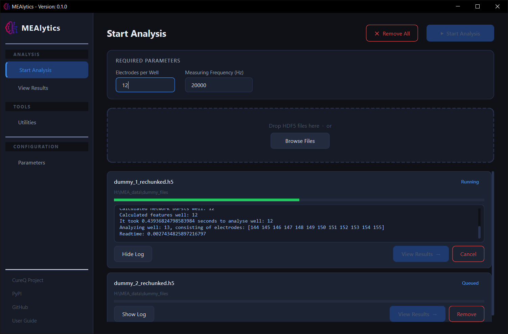
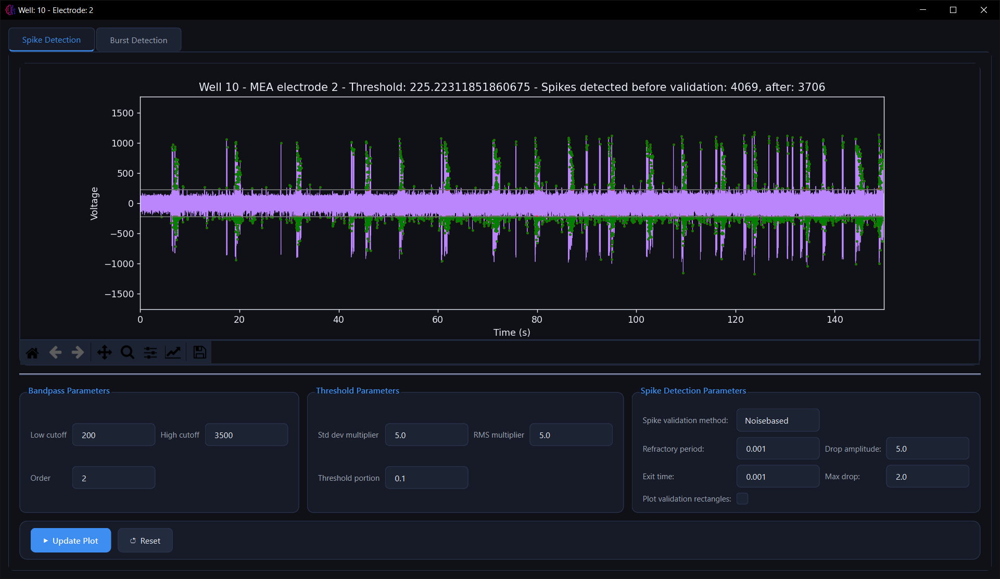
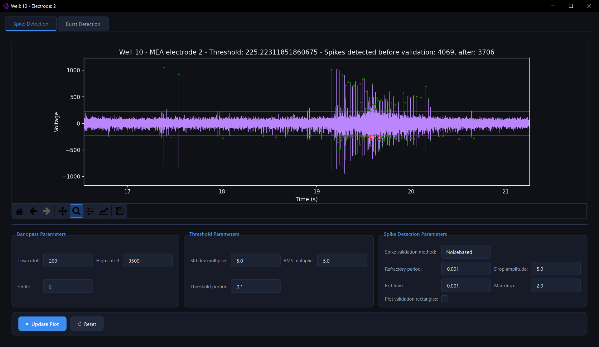
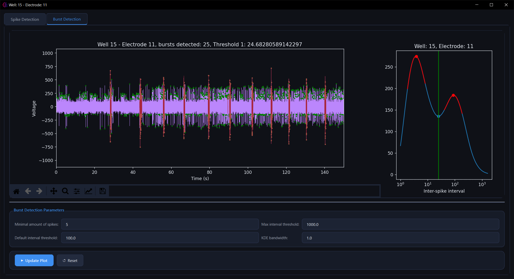
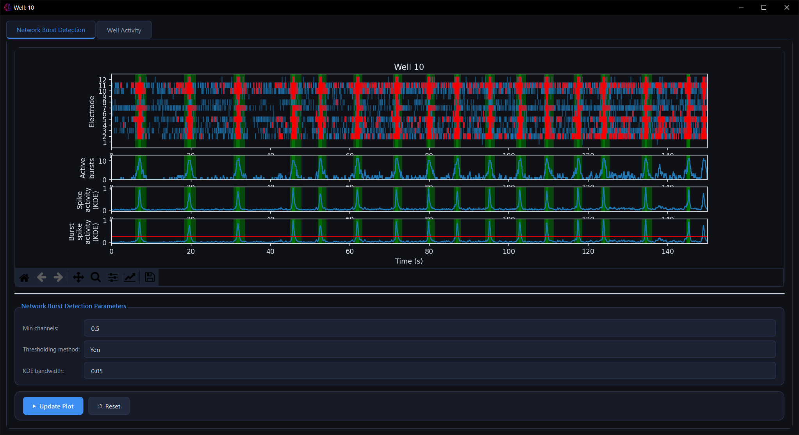
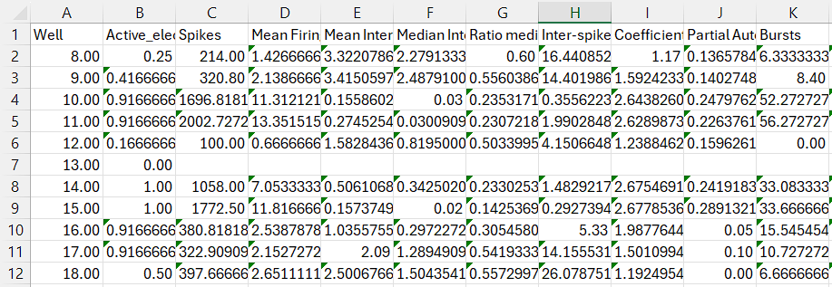
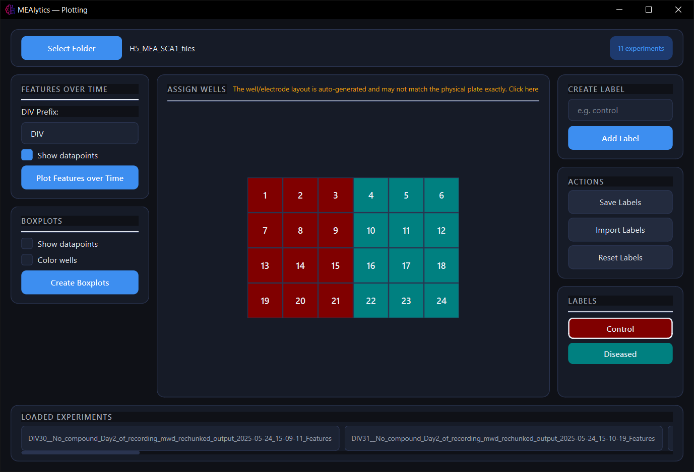
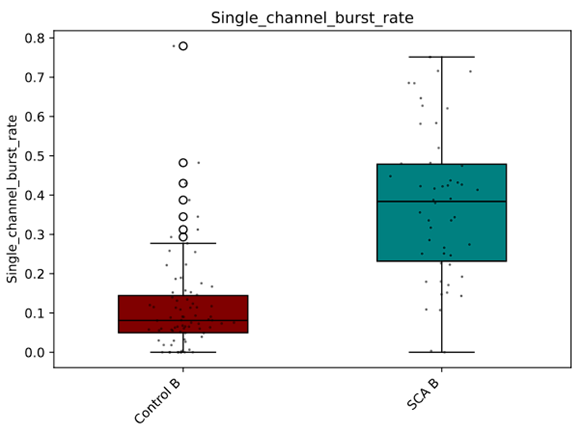
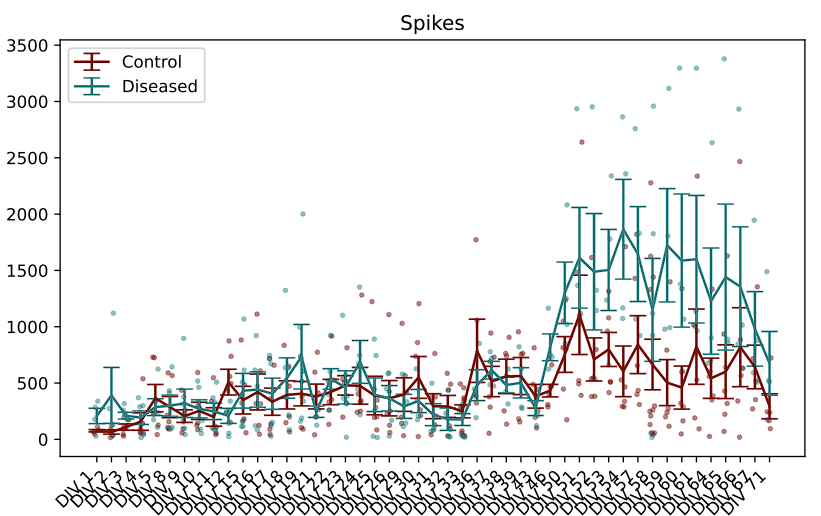
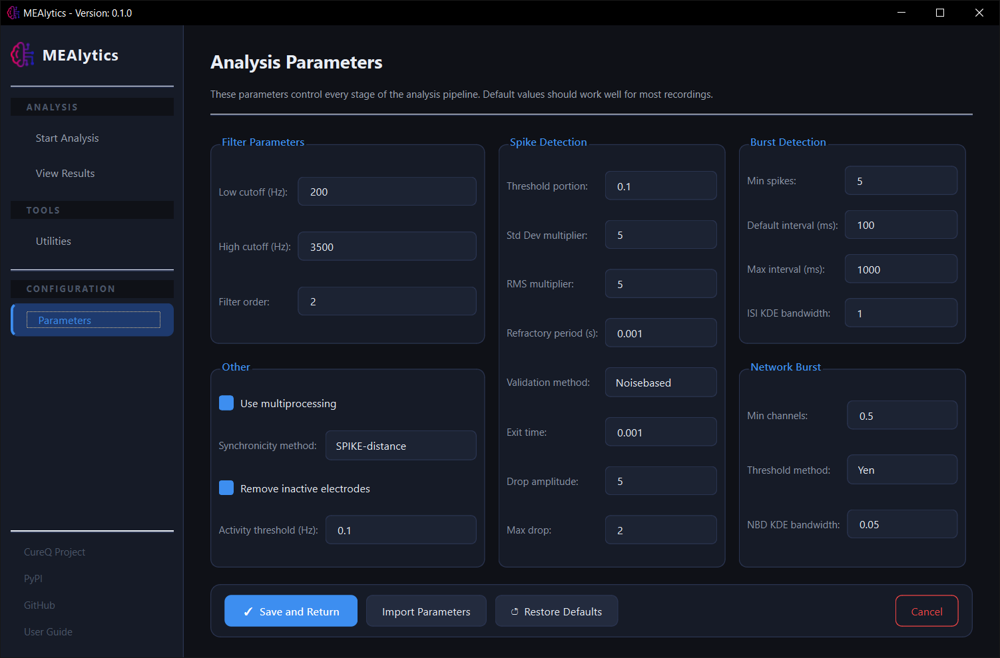

#### Please note that this project is still in development.

# MEAlytics

MEAlytics is an open-source Python tool for processing Microelectrode Array (MEA) data.<br>
This repository is maintained by the Amsterdam University of Applied Sciences (AUAS).<br>

### Demo
https://github.com/user-attachments/assets/c8183761-5aa5-45fa-985a-2332cf8d5415

#### [For more information on functionality and usage, please refer to the documentation](https://cureq.github.io/MEAlytics/)

## CureQ
This tool was created for the CureQ consortium.<br>
For more information about the CureQ project, visit https://cureq.nl/.
___

## Install the library

MEAlytics can be downloaded from the Python Package Index (PyPI) using PIP:
```shell
pip install MEAlytics 
```
#### More elaborate installation instructions, inlcuding a 'plug-and-play' installer can be found in the [User Guide](https://cureq.github.io/MEAlytics/installation).<br>
---

## Library usage
MEAlytics' functions can be called from a regular Python script, this might be useful to automate processing large datasets. <br>

```python
from MEAlytics.mea import analyse_wells, get_default_parameters

fileadress='/path/to/your/experiment.h5'
sampling_rate=20000
electrode_amount=12

# Get and edit parameters
parameters = get_default_parameters()
parameters['use multiprocessing'] = True

if __name__ == '__main__':
    analyse_wells(fileadress=fileadress,
                  sampling_rate=sampling_rate,
                  electrode_amnt=electrode_amount,
                  parameters=parameters
                  )
```

---
## MEA GUI
However, the main way that MEAlytics is meant to be used, is with the Graphical User Interface (GUI). <br>
The GUI can be used to initialize the analysis, but also contains other features such as interactive data visualization and plotting. <br>

### Opening the GUI
There are multiple ways to launch the GUI:

#### Opening from Python script
```python
from MEAlytics.GUI.mea_analysis_tool import MEA_GUI

if __name__=="__main__":
    MEA_GUI()
```

#### Launching from command prompt
```shell
C:\Users>mealytics
```

or 

```shell
C:\Users>python -m MEAlytics
```
#### Create shortcuts
This process can be simplified by creating shortcuts that in essence perform the same process. In the command prompt, enter “mealytics –create-shortcut”.

```shell
C:\Users>MEAlytics --create-shortcut
Desktop shortcut created at C:\Users\Desktop\MEAlytics.lnk
```
The output should look like this, and a shortcut should appear on your desktop and start menu.

#### From the installer
When you have installed MEAlytics using the [Windows installer](https://github.com/CureQ/MEAlytics/releases), you can open it the same as you would with any application, using the desktop or start menu.

---

## MEAlytics functionality
This section showcases the basic functionality of MEAlytics, for more information, refer to [the documentation.](https://cureq.github.io/MEAlytics/)

### File Analysis
MEAlytics allows for easy batch processing of files.<br>
Optionally, MEAlytics optionally utilizes **multiprocessing** to significantly speed up the analysis when resources are available!



### Spike detection

After performing the analysis, the user can inspect the results using the GUI!<br>
The user can alter all parameters regarding spike, burst and network burst detection and immediately apply these changes to see how they alter the analysis. This allows you to quickly see the effect of parameter changes, without having to redo the entire analysis. <br>



Additonally, the user can zoom in on the data to view the smaller timeframes.



### Single channel burst detection

Burst detection is performed using the logISI method, meaning that the thresholds adapt to the input data!



### Network burst detection

Network burst detection is performed by looking for high activity bursting periods on multiple channels.



### Features

MEAlytics calculates over 40 descriptive well and electrode features and saves them in a csv file. These can then be read by other applications such as excel.



### Group comparison

The resulting features of multiple experiments can be combined to compare the differences between two groups using the plotting module.



Compare two groups with each other and create visualisations for all features. Output is saved in pdf format.



Visualise the development of features over time by simply adding a prefix to your feature files.



### Parameters
Lastly, MEAlytics offers a wide range of parameters that can be used to alter the analysis! However, all parameters have default values that are backed by literature.



<!--
**CureQ/CureQ** is a ✨ _special_ ✨ repository because its `README.md` (this file) appears on your GitHub profile.
-->
