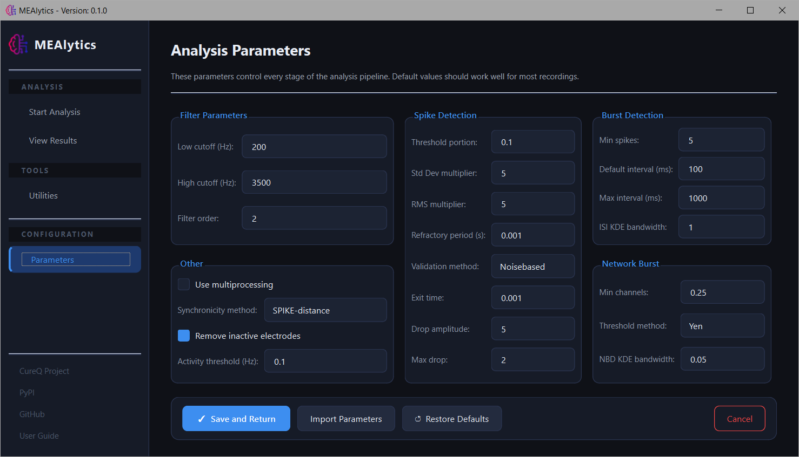
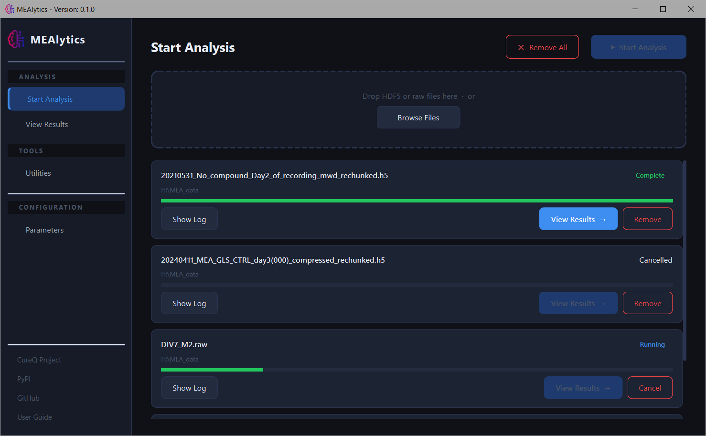

## Set parameters
First, navigate to the “Parameters” tab in the sidebar to alter analysis parameters.

<br>

From here it is possible to alter the parameters or import settings from a previous experiment. To save the parameters, press **Save and Return**, simply returning to another tab will not apply your changes.

**Restore Defaults** can be used to restore all parameters to the default values.

Parameters from previous experiments can be loaded using **Import Parameters**. Every experiment will generate a file called ```parameters.json``` in the output folder. These files can be selected to copy the parameters to the current analysis.

For more information about each parameter, see [Parameters](parameters.md).


## Analyse file
In the sidebar, select **Start Analysis**.
Select one or multiple files using the **Browse Files** button, or drag the files into the box. Press **Start Analysis** in the top right corner of the window to initialize the analysis.


<br>

## Rechunking
If your MultiChannel Systems hdf5 file has not been rechunked yet, the application will first rechunk the file, creating a copy, and then process the new file. Files can also be rechunked manually. For more information about why files are rechunked, see [Compress/Rechunk files](compress_rechunk.md).
