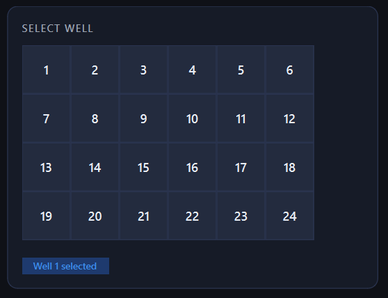
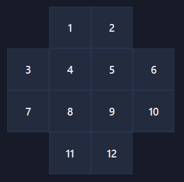

MEAlytics supports both MultiChannel Systems (MCS) and Axion Biosystems MEA recordings.

### Multichannel Systems
MEAlytics is able to process the raw data from MCS machines, following conversion to the hdf5 format using the [Multi Channel DataManager](https://www.multichannelsystems.com/software/multi-channel-datamanager). MEAlytics will extract the necessary metadata, such as the number of electrodes per well, and the sampling rate.

### Axion BioSystems
MEAlytics is able to directly read the Axion BioSystems' .raw file format using Python. Again, it will automatically extract the required metadata for the analysis.

## Displaying different plate types
While MEAlytics does read the number of wells, and the number of electrodes from the metadata, it does not read the locations and ordering of these rows. As such, the way that wells and electrodes are displayed inside of MEAlytics is using an automatically generated layout.

#### Displaying wells
When given a certain number of wells, MEAlytics will automatically calculate the optimal number of rows and columns to display in the interface. For example, for a measurement containing 24 wells, the wells will be displayed as follows:

**This means that the way that wells are displayed in MEAlytics does not always match how the wells are arranged in the actual plate**. However, wells in MEAlytics (and in the output feature files) are always numbered from top left to bottom right.

#### Displaying electrodes
Displaying electrodes will follow a similar procedure, where the number of rows and columns to display are automatically determined. MEAlytics does however contain a default configuration for wells containing 12 electrodes. Those electrodes will be displayed as follows:

Where again electrodes are numbered from top left to bottom right.